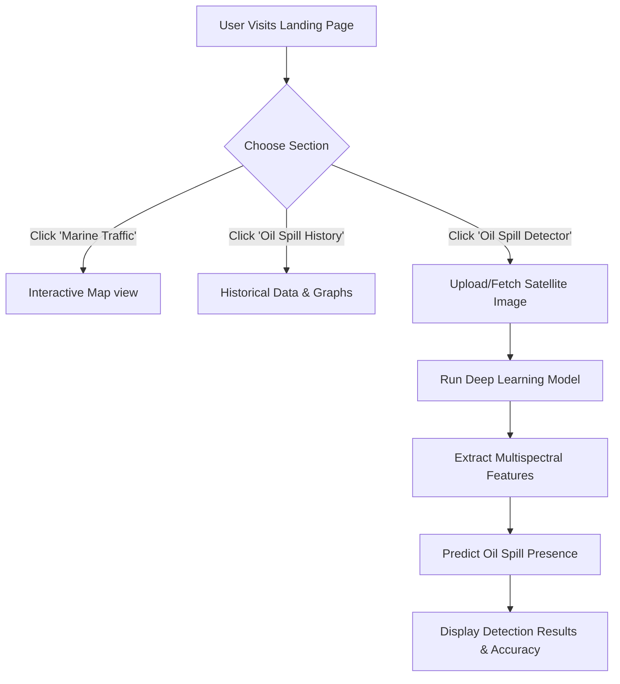

<div align="center">
  <div style="background-color: #fff; display: inline-block; padding: 10px; border-radius: 50%;">
      
  </div>
  <h1 align="center">Marine Oil Spill Detection</h1>
  
  <p align="center">
    <strong>Monitor, analyze, and detect marine oil spills with cutting-edge technology and AI analytics.</strong>
    <br />
    <a href="https://github.com/afzalkhanofficial/Marine-Oil-Spill-Detection"><strong>Explore the docs »</strong></a>
    <br />
    <br />
    <a href="#">View Demo</a>
    ·
    <a href="https://github.com/afzalkhanofficial/Marine-Oil-Spill-Detection/issues">Report Bug</a>
    ·
    <a href="https://github.com/afzalkhanofficial/Marine-Oil-Spill-Detection/issues">Request Feature</a>
  </p>
</div>

<!-- Badges -->
<div align="center">
  
  
  
  
  
  
</div>

<!-- Contributors -->
<div align="center">
  <h3>✨Contributors</h3>
  <table style="border: none;">
    <tr style="border: none;">
      <td align="center" style="border: none;">
        <a href="#">
          
        </a>
        <br />
        <strong>Afzal Khan</strong>
      </td>
      <td align="center" style="border: none;">
        <a href="#">
          
        </a>
        <br />
        <strong>Ram Chandra G.</strong>
      </td>
      <td align="center" style="border: none;">
        <a href="#">
          
        </a>
        <br />
        <strong>Prabhushanker C</strong>
      </td>
    </tr>
  </table>
</div>

---

## 📖 About The Project

**Marine Oil Spill Detection** is an advanced environmental monitoring system designed to protect marine ecosystems. Oil spills destroy marine habitats and affect over 800 species annually. Our system combines satellite imagery, AI analysis, and real-time monitoring to combat oil pollution effectively.

Our mission is to provide early spill detection within 2 hours of occurrence with high accuracy, enabling rapid response and historical data analysis for prevention strategies.

### ✨ Key Features

* **Interactive Map:** Visualize current marine traffic and past oil spill events on a dynamic, interactive map powered by Leaflet.js.
* **Historical Data:** Analyze trends with detailed historical graphs to enhance prevention strategies.
* **AI Image Detection:** Employ Deep Learning models (TensorFlow/Keras) trained on satellite imagery to detect potential oil spills with up to 95% accuracy.
* **Real-time Monitoring:** 24/7 monitoring capabilities utilizing Earth observation satellites like Sentinel-2.
* **Intelligent Infrastructure:** Uses scalable cloud infrastructure and geospatial analysis to process and render multispectral data.

---

## 🛠️ Built With

* [HTML5 & CSS3](https://developer.mozilla.org/en-US/docs/Web/Guide/HTML/HTML5)
* [Tailwind CSS](https://tailwindcss.com/)
* [JavaScript](https://developer.mozilla.org/en-US/docs/Web/JavaScript)
* [Python & Flask](https://palletsprojects.com/p/flask/)
* [TensorFlow & OpenCV](https://www.tensorflow.org/)
* [Leaflet.js & GeoPandas](https://leafletjs.com/)

---

## 🚀 User Flow



---

## 💻 Getting Started

This project consists of an interactive front-end that connects to a Python-based intelligent backend for real-time AI processing.

### Prerequisites

You simply need a modern web browser and Python 3.x installed on your local machine for full functionality.

### Installation

1. Clone the repo
   ```sh
   git clone https://github.com/afzalkhanofficial/Marine-Oil-Spill-Detection.git
   ```
2. Navigate to the project directory
   ```sh
   cd Marine-Oil-Spill-Detection
   ```
3. Open `index.html` in your browser, or start a local server:
   ```sh
   # If you use Node.js
   npx serve .
   
   # Or using Python's built-in server
   python -m http.server 8000
   ```
4. Access the app by navigating to `http://localhost:8000` (or `http://localhost:3000` for `serve`).

---

## 📜 License

Distributed under the MIT License. See `LICENSE` for more information.

<div align="center">
  <br />
  Made with 💙 by the <b>Marine Oil Spill Detection</b> team
</div>
